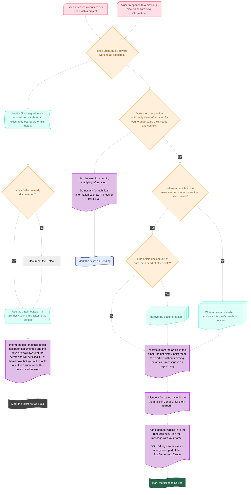

## Help Requests General Flow
This workflow documents the lifecycle of tickets in JustServe's Zendesk

See [instructions on writing a defect](./Document-a-Defect.md).

```mermaid
---
config:
  theme: neo-dark
---
flowchart TD
    n1["User expresses a concern or a need with a project"] --> n7["Is the JustServe Software working as expected?"]
    n2@{ label: "Is there an article in the resource hub that answers the user's needs?" } -- Yes --> n3["Is the article unclear, out of date, or in need of other edits?"]
    n2 -- No --> n4@{ label: "Write a new article which answers this user's needs or concern" }
    n3 -- Yes --> n5["Improve the documentation"]
    n3 -- No --> n6@{ label: "Insert text from the article in the email. Do not simply point them to an article without iterating the article's message in an organic way" }
    n5 --> n6
    n7 --> n10["Use the Jira integration with zendesk to search for an existing defect report for this defect"] & n17["Does the User provide sufficiently clear information for you to understand their needs and context?"]
    n8["Is this Defect already documented? <br>"] -- No --> n9["Document the Defect"]
    n10 --> n8
    n4 --> n6
    n8 -- Yes --> n11["Use the Jira integration in Zendesk to link this ticket to the Defect"]
    n9 --> n11
    n11 --> n12["Inform the user that this defect has been documented and the devs are now aware of the defect and will be fixing it. Let them know that you will be able to let them know when this defect is addressed."]
    n12 --> n13@{ label: "Mark the ticket as 'On Hold'" }
    n6 --> n14["Inlcude a formatted hyperlink to the article in zendesk for them to read. <br>"]
    n14 --> n15["Thank them for writing in to the resource hub. Sign the message with your name, <br><br>DO NOT sign emails as an anonymous part of the JustServe Help Center"]
    n15 --> n16["Mark the ticket as Solved"]
    n17 -- Yes --> n2
    n17 --> n18["Ask the user for specific, clarifying information. <br><br>Do not ask for technical information such as API logs or HAR files. <br>"]
    n18 --> n19["Mark the ticket as Pending"]
    n20["A user responds to a previous discussion with new information <br>"] --> n7
    n1@{ shape: card}
    n7@{ shape: diam}
    n2@{ shape: diam}
    n3@{ shape: diam}
    n4@{ shape: docs}
    n5@{ shape: docs}
    n6@{ shape: doc}
    n10@{ shape: stored-data}
    n17@{ shape: diam}
    n8@{ shape: diam}
    n11@{ shape: stored-data}
    n12@{ shape: doc}
    n13@{ shape: paper-tape}
    n14@{ shape: doc}
    n15@{ shape: doc}
    n16@{ shape: paper-tape}
    n18@{ shape: doc}
    n19@{ shape: paper-tape}
    n20@{ shape: card}
     n1:::Rose
     n7:::Peach
     n2:::Peach
     n3:::Peach
     n4:::Pine
     n4:::Aqua
     n5:::Sky
     n5:::Aqua
     n6:::email
     n10:::Sky
     n10:::Aqua
     n17:::Peach
     n8:::Peach
     n9:::Ash
     n11:::Sky
     n11:::Aqua
     n12:::email
     n13:::Ash
     n13:::OnHold
     n13:::OnHold
     n14:::email
     n15:::email
     n16:::Pine
     n18:::Aqua
     n18:::Ash
     n18:::email
     n19:::Sky
     n20:::Rose
    classDef Peach stroke-width:1px, stroke-dasharray:none, stroke:#FBB35A, fill:#FFEFDB, color:#8F632D
    classDef email stroke:#AA00FF, fill:#E1BEE7, color:#000000
    classDef Aqua stroke-width:1px, stroke-dasharray:none, stroke:#46EDC8, fill:#DEFFF8, color:#378E7A
    classDef OnHold stroke-width:1px, stroke-dasharray: 0, stroke:#757575, fill:#424242, color:#FFFFFF
    classDef Pine stroke-width:1px, stroke-dasharray:none, stroke:#254336, fill:#27654A, color:#FFFFFF
    classDef Sky stroke-width:1px, stroke-dasharray:none, stroke:#374D7C, fill:#E2EBFF, color:#374D7C
    classDef Ash stroke-width:1px, stroke-dasharray:none, stroke:#999999, fill:#EEEEEE, color:#000000
    classDef Rose stroke-width:1px, stroke-dasharray:none, stroke:#FF5978, fill:#FFDFE5, color:#8E2236

```
