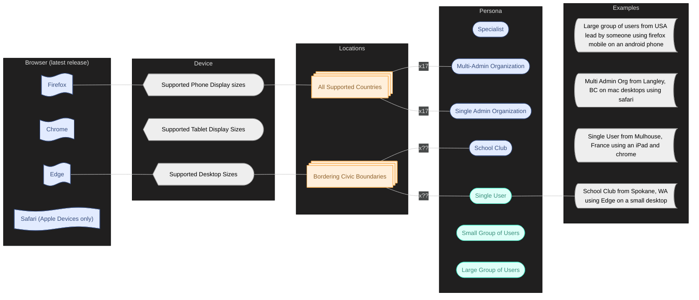

# Persona Matrix
The targeted user is defined by a matrix of locations, devices, browsers and personas, as illustrated in the below diagram. 

```mermaid
---
config:
  theme: neo-dark
---
flowchart LR
 subgraph s2["Locations"]
        n8["All Supported Countries"]
        n9["Bordering Civic Boundaries <br>"]
  end
 subgraph s1["Persona"]
        n1(["Specialist"])
        n2(["Multi-Admin Organization"])
        n3(["Single Admin Organization"])
        n4(["School Club"])
        n5(["Single User"])
        n6(["Small Group of Users"])
        n7(["Large Group of Users"])
  end
 subgraph s3["Examples"]
        n11["Large group of users from USA lead by someone using firefox mobile on an android phone"]
        n10["Multi Admin Org from Langley, BC on mac desktops using safari"]
        n12["Single User from Mulhouse, France using an iPad and chrome"]
        n13["School Club from Spokane, WA using Edge on a small desktop"]
  end
 subgraph s4["Device"]
        n15["Supported Phone Display sizes"]
        n19["Supported Tablet Display Sizes"]
        n20["Supported Desktop Sizes"]
  end
 subgraph s5["Browser (latest release)"]
        n21["Firefox"]
        n22["Chrome"]
        n23["Edge"]
        n24["Safari (Apple Devices only)"]
  end
    n8 -- x17 --- n2 & n3
    n9 -- x?? --- n4 & n5
    n15 --- n8
    n21 --- n15
    n23 --- n20
    n20 --- n9
    n5 --- n13
    n8@{ shape: procs}
    n9@{ shape: procs}
    n11@{ shape: stored-data}
    n10@{ shape: stored-data}
    n12@{ shape: stored-data}
    n13@{ shape: stored-data}
    n15@{ shape: display}
    n19@{ shape: display}
    n20@{ shape: display}
    n21@{ shape: paper-tape}
    n22@{ shape: paper-tape}
    n23@{ shape: paper-tape}
    n24@{ shape: paper-tape}
     n8:::Rose
     n8:::Peach
     n9:::Peach
     n1:::Sky
     n2:::Sky
     n3:::Sky
     n4:::Sky
     n5:::Ash
     n5:::Aqua
     n6:::Aqua
     n7:::Aqua
     n11:::Ash
     n10:::Ash
     n12:::Ash
     n13:::Ash
     n15:::Ash
     n19:::Ash
     n20:::Ash
     n21:::Sky
     n22:::Sky
     n23:::Sky
     n24:::Sky
    classDef Rose stroke-width:1px, stroke-dasharray:none, stroke:#FF5978, fill:#FFDFE5, color:#8E2236
    classDef Aqua stroke-width:1px, stroke-dasharray:none, stroke:#46EDC8, fill:#DEFFF8, color:#378E7A
    classDef Peach stroke-width:1px, stroke-dasharray:none, stroke:#FBB35A, fill:#FFEFDB, color:#8F632D
    classDef Ash stroke-width:1px, stroke-dasharray:none, stroke:#999999, fill:#EEEEEE, color:#000000
    classDef Sky stroke-width:1px, stroke-dasharray:none, stroke:#374D7C, fill:#E2EBFF, color:#374D7C
```
