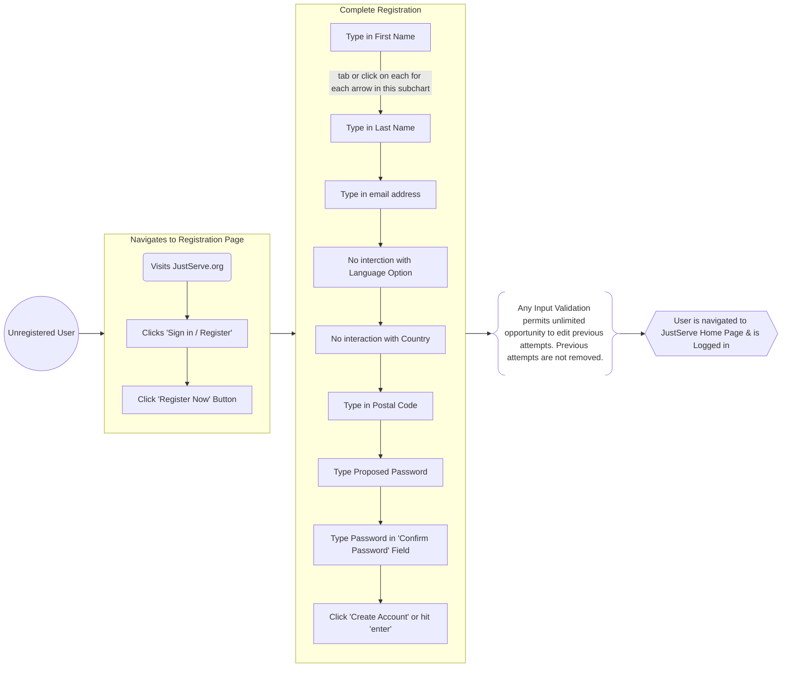

```mermaid
flowchart LR
subgraph s1["Navigates to Registration Page"]
B("Visits JustServe.org<br>")
C@{ label: "Clicks 'Sign in / Register'<br>" }
D@{ label: "Click 'Register Now' Button<br>" }
end
subgraph s2["Complete Registration"]
n2["Type in First Name"]
n3["Type in Last Name"]
n4["Type in email address"]
n5["No interction with Language Option<br>"]
n6["No interaction with Country<br>"]
n7["Type in Postal Code<br>"]
n8["Type Proposed Password<br>"]
n9@{ label: "Type Password in 'Confirm Password' Field<br>" }
n12@{ label: "Click 'Create Account' or hit 'enter'<br>" }
end
B --> C
C --> D
A(("Unregistered User <br>")) --> s1
s1 --> s2
n2 -- tab or click on each for each arrow in this subchart --> n3
n3 --> n4
n4 --> n5
n5 --> n6
n6 --> n7
n8 --> n9
s2 --> n10["Any Input Validation permits unlimited opportunity to edit previous attempts. Previous attempts are not removed.<br>"]
n7 --> n8
n10 --> n11["User is navigated to JustServe Home Page &amp; is Logged in<br>"]
n9 --> n12
C@{ shape: rect}
D@{ shape: rect}
n3@{ shape: rect}
n4@{ shape: rect}
n5@{ shape: rect}
n9@{ shape: rect}
n12@{ shape: rect}
n10@{ shape: braces}
n11@{ shape: hex}
```